# Execution Plan

## Detailed Analysis Summary

### Change Impact Assessment
- **User-facing changes**: Yes - 고객용 주문 인터페이스 및 관리자 대시보드 신규 구축
- **Structural changes**: Yes - 전체 시스템 아키텍처 신규 설계 (React SPA + FastAPI + PostgreSQL)
- **Data model changes**: Yes - 8개 엔티티 신규 설계 (Store, Table, Menu, Category, Order, OrderItem, TableSession, Admin)
- **API changes**: Yes - 고객용 5개 + 관리자용 11개 API 엔드포인트 신규 구축
- **NFR impact**: Yes - 실시간 통신(SSE), JWT 인증, bcrypt 해싱, 트랜잭션 관리

### Risk Assessment
- **Risk Level**: Medium
- **Rollback Complexity**: Easy (Greenfield - 롤백 불필요)
- **Testing Complexity**: Moderate (다중 컴포넌트 간 통합 테스트 필요)

---

## Workflow Visualization

### Mermaid Diagram

```mermaid
flowchart TD
    Start(["User Request"])

    subgraph INCEPTION["INCEPTION PHASE"]
        WD["Workspace Detection<br/>COMPLETED"]
        RA["Requirements Analysis<br/>COMPLETED"]
        US["User Stories<br/>EXECUTE"]
        WP["Workflow Planning<br/>COMPLETED"]
        AD["Application Design<br/>EXECUTE"]
        UG["Units Generation<br/>EXECUTE"]
    end

    subgraph CONSTRUCTION["CONSTRUCTION PHASE"]
        FD["Functional Design<br/>EXECUTE"]
        NFRA["NFR Requirements<br/>EXECUTE"]
        NFRD["NFR Design<br/>EXECUTE"]
        ID["Infrastructure Design<br/>EXECUTE"]
        CG["Code Generation<br/>EXECUTE"]
        BT["Build and Test<br/>EXECUTE"]
    end

    Start --> WD
    WD --> RA
    RA --> US
    US --> WP
    WP --> AD
    AD --> UG
    UG --> FD
    FD --> NFRA
    NFRA --> NFRD
    NFRD --> ID
    ID --> CG
    CG --> BT
    BT --> End(["Complete"])

    style WD fill:#4CAF50,stroke:#1B5E20,stroke-width:3px,color:#fff
    style RA fill:#4CAF50,stroke:#1B5E20,stroke-width:3px,color:#fff
    style WP fill:#4CAF50,stroke:#1B5E20,stroke-width:3px,color:#fff
    style US fill:#FFA726,stroke:#E65100,stroke-width:3px,stroke-dasharray: 5 5,color:#000
    style AD fill:#FFA726,stroke:#E65100,stroke-width:3px,stroke-dasharray: 5 5,color:#000
    style UG fill:#FFA726,stroke:#E65100,stroke-width:3px,stroke-dasharray: 5 5,color:#000
    style FD fill:#FFA726,stroke:#E65100,stroke-width:3px,stroke-dasharray: 5 5,color:#000
    style NFRA fill:#FFA726,stroke:#E65100,stroke-width:3px,stroke-dasharray: 5 5,color:#000
    style NFRD fill:#FFA726,stroke:#E65100,stroke-width:3px,stroke-dasharray: 5 5,color:#000
    style ID fill:#FFA726,stroke:#E65100,stroke-width:3px,stroke-dasharray: 5 5,color:#000
    style CG fill:#4CAF50,stroke:#1B5E20,stroke-width:3px,color:#fff
    style BT fill:#4CAF50,stroke:#1B5E20,stroke-width:3px,color:#fff
    style Start fill:#CE93D8,stroke:#6A1B9A,stroke-width:3px,color:#000
    style End fill:#CE93D8,stroke:#6A1B9A,stroke-width:3px,color:#000
    style INCEPTION fill:#BBDEFB,stroke:#1565C0,stroke-width:3px,color:#000
    style CONSTRUCTION fill:#C8E6C9,stroke:#2E7D32,stroke-width:3px,color:#000

    linkStyle default stroke:#333,stroke-width:2px
```



### Text Alternative

```
Phase 1: INCEPTION
  - Workspace Detection        (COMPLETED)
  - Reverse Engineering         (SKIPPED - Greenfield)
  - Requirements Analysis       (COMPLETED)
  - User Stories                (EXECUTE)
  - Workflow Planning           (COMPLETED)
  - Application Design          (EXECUTE)
  - Units Generation            (EXECUTE)

Phase 2: CONSTRUCTION (per-unit)
  - Functional Design           (EXECUTE)
  - NFR Requirements            (EXECUTE)
  - NFR Design                  (EXECUTE)
  - Infrastructure Design       (EXECUTE)
  - Code Generation             (EXECUTE)
  - Build and Test              (EXECUTE)

Phase 3: OPERATIONS
  - Operations                  (PLACEHOLDER)
```

---

## Phases to Execute

### INCEPTION PHASE
- [x] Workspace Detection (COMPLETED)
- [x] Reverse Engineering (SKIPPED - Greenfield project)
- [x] Requirements Analysis (COMPLETED)
- [ ] User Stories - EXECUTE
  - **Rationale**: 다중 사용자 유형 (고객, 관리자), 복잡한 비즈니스 로직, 사용자 워크플로우 정의 필요
- [x] Workflow Planning (COMPLETED)
- [ ] Application Design - EXECUTE
  - **Rationale**: 신규 프로젝트로 컴포넌트 구조, 서비스 레이어, 데이터 모델 설계 필요
- [ ] Units Generation - EXECUTE
  - **Rationale**: 복잡한 시스템으로 다중 유닛 분해 필요 (Frontend Customer, Frontend Admin, Backend API, Database)

### CONSTRUCTION PHASE (per-unit)
- [ ] Functional Design - EXECUTE
  - **Rationale**: 8개 엔티티 데이터 모델, 복잡한 비즈니스 로직 (세션 관리, 주문 처리), 상세 설계 필요
- [ ] NFR Requirements - EXECUTE
  - **Rationale**: 실시간 통신(SSE), JWT 인증, bcrypt 해싱, 트랜잭션 관리 등 NFR 요구사항 존재
- [ ] NFR Design - EXECUTE
  - **Rationale**: NFR Requirements에서 도출된 패턴을 설계에 반영 필요
- [ ] Infrastructure Design - EXECUTE
  - **Rationale**: Docker 컨테이너 배포, PostgreSQL 설정, 서비스 간 통신 설계 필요
- [ ] Code Generation - EXECUTE (ALWAYS)
  - **Rationale**: 코드 구현 필수
- [ ] Build and Test - EXECUTE (ALWAYS)
  - **Rationale**: 빌드 및 테스트 검증 필수

### OPERATIONS PHASE
- [ ] Operations - PLACEHOLDER
  - **Rationale**: 향후 배포 및 모니터링 워크플로우 확장 예정

---

## Success Criteria
- **Primary Goal**: 고객이 테이블에서 메뉴를 조회하고 주문할 수 있는 완전한 테이블오더 시스템 구축
- **Key Deliverables**:
  - React SPA (고객용 + 관리자용)
  - FastAPI 백엔드 서버
  - PostgreSQL 데이터베이스 스키마
  - Docker 배포 설정
  - Unit tests
- **Quality Gates**:
  - 모든 API 엔드포인트 정상 동작
  - SSE 실시간 주문 업데이트 2초 이내
  - JWT 인증 및 세션 관리 정상 동작
  - Unit tests 통과
